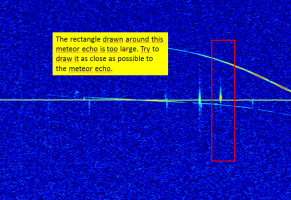
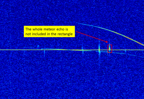
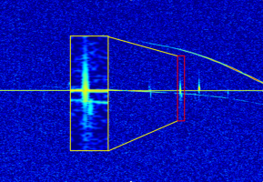
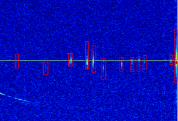
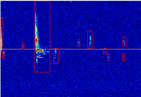
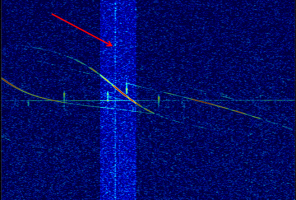

# Meteor Scatter Radio Observations

The Geminids are a prolific meteor shower caused by the object 3200 Phaethon, which is thought to be an asteroid of the same type as 2 Pallas. This would make the Geminids, together with the Quadrantids, the only major meteor showers not originating from a comet.
The meteors from this shower are much slower (35 km/s) than most other meteor showers, can be seen in December and peak around December 7-17. Let’s see if we can confirm this with our radio observations!

Research Lab and Project Contributors: [BRAMS: Belgian RAdio Meteor Stations](https://brams.aeronomy.be/)

## How to identify meteor echoes in radio observations?

Time is on the horizontal axis (5 minutes) and frequency on the vertical axis (200 Hz). The horizontal signal in the middle of the image is the direct signal coming from the transmitter. Long-lasting and curved signals are reflections of the radio wave on airplanes. Meteor echoes mostly appear as vertical signals, some very bright, some very faint. Sometimes they can be discontinuous. 

## What do we expect from you?

Draw rectangles around meteor echoes. Do not worry if the rectangle also includes other signals such as e.g. a plane echo.

Once you have finished click on the done button.

If you want to remove a rectangle that you drew by mistake, click on the black cross in the upper right corner of the rectangle. You may have to stretch out the rectangle to access the black cross.

## Key Points

1. Rectangles that are too large

Try to draw the smallest possible rectangle around the meteor echo. The example below shows a rectangle that is too large.

2. Rectangles that are too small

Try to include the whole meteor echo when drawing the rectangle. The example below shows a rectangle where the whole meteor echo is not included.
Note that sometimes the meteor echo can be discontinuous. In this case draw the rectangle to include all parts of the meteor echo.

3. Overlapping Meteor Echoes

Two meteor echoes may sometimes appear very close to each other. If they overlap, draw only one rectangle and consider it as only one meteor echo. An example is shown below where a zoom is shown to the left (yellow rectangle). The two potential meteor echoes are too close to each other, just draw one rectangle.

4. Edges of the Image

Be careful also to not miss meteor echoes appearing near the edges of the image (see example with the bright meteor to the right edge of the image below).

5. Meteor echoes during meteor showers

During meteor showers, it is very common to see much brighter and/or much longer duration meteor echoes with various and complex shapes (e.g. meteor 4 counted from left).

6. Interference
In some images you may also see vertical signals spanning the whole vertical axis. These are broad-band interference signals, not meteor echoes. They can also appear discontinuous. An example is shown below.
